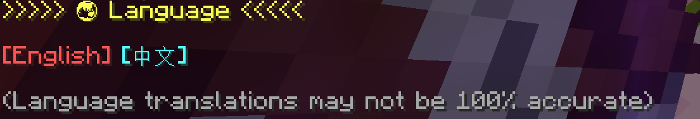

# 指令列表

## `/reload`

重新載入檔案，同時也會安裝死亡交換，僅限OP玩家操作。  
[詳情請查看Minecraft Wiki](https://zh.minecraft.wiki/w/%E5%91%BD%E4%BB%A4/reload)

## `/tag <玩家> add admin` {#tag-add-admin}

給予特定玩家管理員權限，僅限OP玩家操作。  
也可以直接切換到創造模式獲得管理員權限。

例如：  
`/tag @s add admin` 給予自己管理員權限。  
`/tag Alex add admin` 給予玩家Alex管理員權限。

## `/tag <玩家> remove admin` {#tag-remove-admin}

移除特定玩家管理員權限，僅限OP玩家操作。

例如：  
`/tag @s remove admin` 移除自己管理員權限。  
`/tag Alex remove admin` 移除玩家Alex管理員權限。

## `/trigger deathswap set 5`

重製遊戲，具有管理員權限的玩家可以使用。

## `/function deathswap:ui/language`

顯示設定語言介面，僅限OP玩家操作。

## `/function deathswap:uninstall`

解除安裝死亡交換，僅限OP玩家操作。