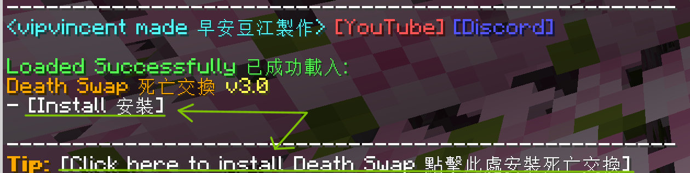

# 安裝指南

資料包放入世界資料夾下的`datapacks`資料夾；模組則放入`mods`資料夾。

:::tip

模組與資料包的所有功能皆為相同。   
資料包僅會套用於單一世界，模組會自動套用於所有世界。   
Fabric需要[**Fabric API**](https://modrinth.com/mod/fabric-api)，Quilt需要[**Quilted Fabric API**](https://modrinth.com/mod/qsl)

:::

然後就可以進入遊戲，接者由OP玩家輸入`/reload`。

輸入`/reload`後，請點擊安裝死亡交換，或者輸入`/function deathswap:install`。

安裝完成後會跳出一個設定語言介面，請選擇你的語言。

然後會重製遊戲。接者如果你是OP玩家，請點擊聊天室的提示，或者切到創造模式，就可以獲得管理員權限。   
手動給予管理員權限可以查看[**指令列表**](./command#給予管理員權限)

獲得管理員權限後就可以打開背包進行遊戲設定。

