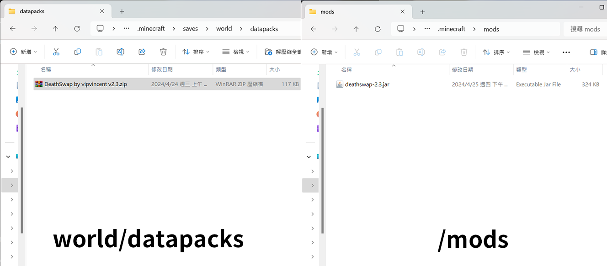
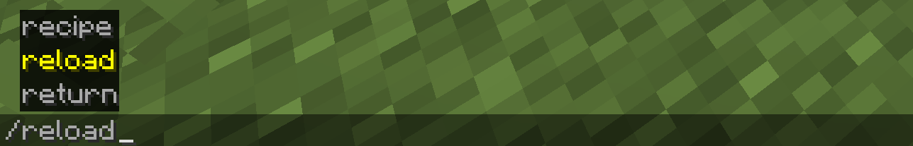
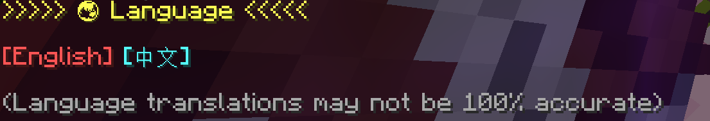
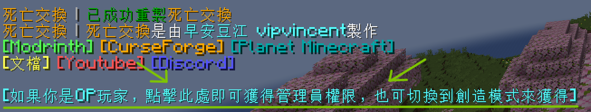
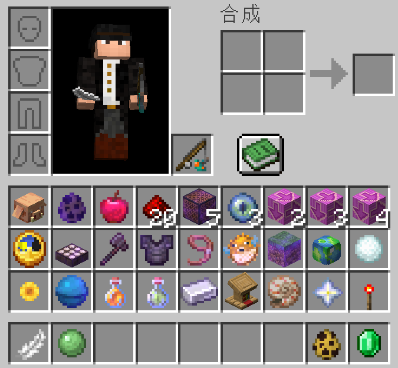

# 如何安裝

:::warning

死亡交換推薦安裝在新建立的世界。  
如果安裝在現有世界會導致你的裝備、物品或者方塊消失，更有可能會導致世界損壞。  
因此如果仍然要安裝在現有世界，請確保你的世界已經備份。  
本人不對任何導致世界損壞、軟體衝突或其他問題進行負責，使用者因自行負責。  

:::

資料包放入世界資料夾下的`datapacks`資料夾；模組則放入`mods`資料夾。

:::tip

模組版本與資料包功能相同，但是會自動套用於所有世界，通常用於伺服器。  
如果你不希望套用於所有世界，請使用資料包。  

:::
:::info

模組載入器支持**Fabric**、**Forge**、**Neoforge**和**Quilt**  
Fabric需要[**Fabric API**](https://modrinth.com/mod/fabric-api)，Quilt需要[**Quilted Fabric API**](https://modrinth.com/mod/qsl)

:::

然後就可以進入遊戲，接者由OP玩家輸入/reload來安裝。

輸入/reload後會跳出一個設定語言介面，請選擇你的語言，該介面僅限OP玩家操作。

然後會重製遊戲。接者如果你是OP玩家，請點擊聊天室的提示，或者切到創造模式，就可以獲得管理員權限。

手動給予管理員權限可以查看[**指令列表**](./command#tag-add-admin)

獲得管理員權限後就可以打開背包進行遊戲設定。

