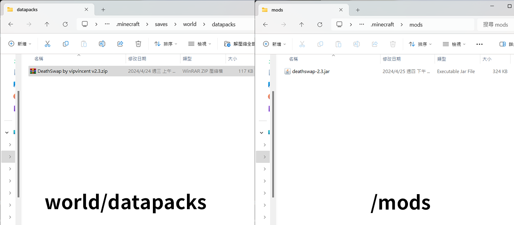
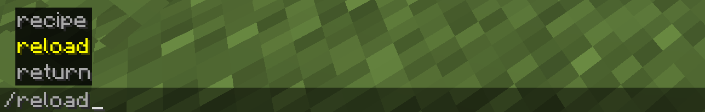
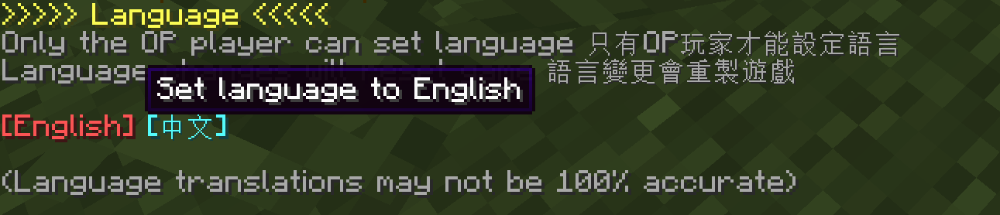
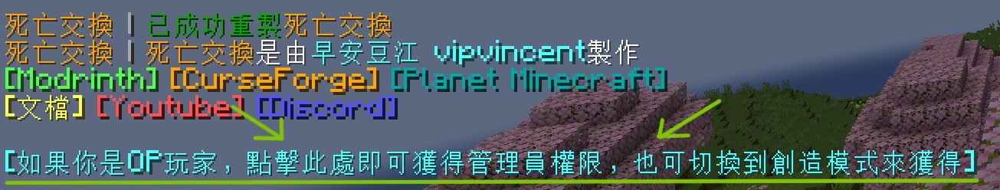
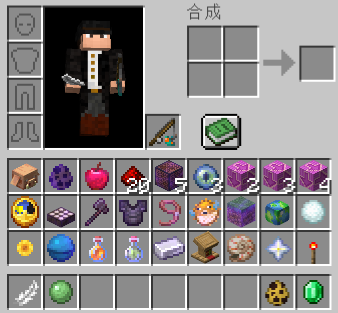

# 如何安裝

資料包放入世界資料夾下的`datapacks`資料夾；模組則放入`mods`資料夾。

:::info

模組載入器僅支持**Fabric**、**Forge**和**Quilt**，暫不支持**Neoforge**  
Fabric需要[**Fabric API**](https://modrinth.com/mod/fabric-api)，Quilt需要[**Quilted Fabric API**](https://modrinth.com/mod/qsl)

:::

然後就可以進入遊戲，接者由OP玩家輸入/reload來安裝。

輸入/reload後會跳出一個設定語言介面，請選擇你的語言，該介面僅限OP玩家操作。

然後會重製遊戲。接者如果你是OP玩家，請點擊聊天室的提示，或者切到創造模式，就可以獲得管理員權限。

手動給予管理員權限可以查看[**指令列表**](./command#tag-add-admin)

獲得管理員權限後就可以打開背包進行遊戲設定。

