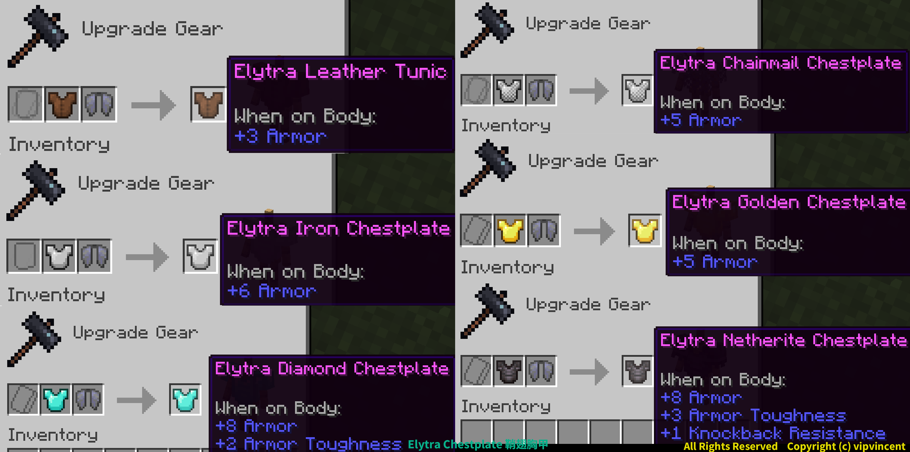

# 鞘翅胸甲

胸甲與鞘翅可以透過鍛造台合成在一起，並同時裝備在身上使用，且兩者功能都能使用。

- 胸甲與鞘翅可同時使用、顯示
- 支援盔甲紋樣
- 支援所有Minecraft的語言

---
## 合成

:::info

胸甲的既有附魔、耐久度以及命名合成時會保留，但是鞘翅上的不會保留。

:::

---
## 下載

<a className="button button--success button--lg" target="_blank" href="https://modrinth.com/datapack/elytra_chestplate">Modrinth</a>