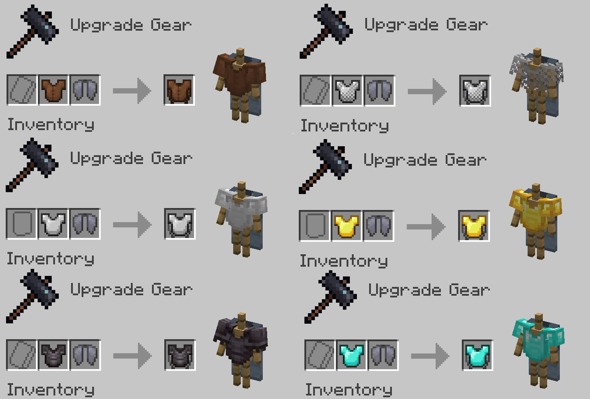

# 鞘翅胸甲

:::tip

需要使用1.21.2的快照24w36a或以上版本

:::

胸甲與鞘翅可以透過鍛造台合成在一起，並同時裝備在身上使用，且兩者功能都能使用。

- 支持原版Minecraft的所有胸甲
- 不需資源包即可支持所有語言(需為Minecraft本身受支持的語言)

---
## 合成

:::info

胸甲的既有附魔、耐久度以及命名合成時會保留，但是鞘翅上的不會保留。

:::

---
## 下載

<a className="button button--success button--lg" href="https://modrinth.com/datapack/elytra_chestplate">Modrinth</a>

##

:::warning

安裝在現有世界，請確保你的世界已經備份。  
本人不對任何導致世界損壞、軟體衝突或其他問題進行負責，使用者因自行負責。
  
:::
