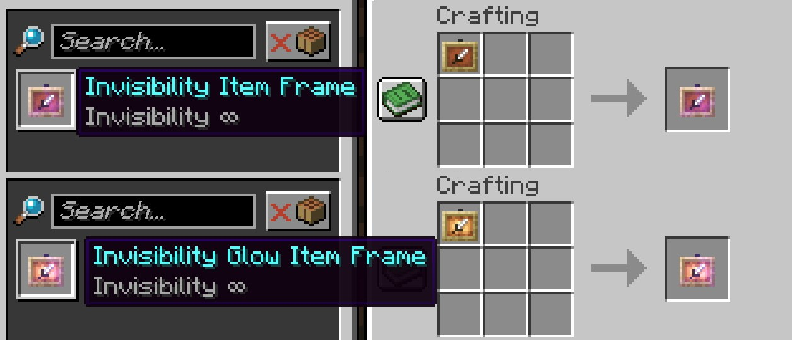

# 合成隱形物品展示框

讓原本需要透過指令獲取的隱形物品展示框，可以透過合成獲取。

---
## 合成

---
## 下載

<a className="button button--success button--lg" href="https://modrinth.com/datapack/invisibility-itemframe">Modrinth</a>

##

:::tip

模組版本僅現在Modrinth網頁上。  
模組版本與資料包功能相同，但是會自動套用於所有世界，通常用於伺服器。  
如果你不希望套用於所有世界，請使用資料包。  

:::

:::info

模組載入器支持**Fabric**、**Forge**、**Neoforge**和**Quilt**  
Fabric需要[**Fabric API**](https://modrinth.com/mod/fabric-api)，Quilt需要[**Quilted Fabric API**](https://modrinth.com/mod/qsl)

:::

:::warning

安裝在現有世界，請確保你的世界已經備份。  
本人不對任何導致世界損壞、軟體衝突或其他問題進行負責，使用者因自行負責。  

:::