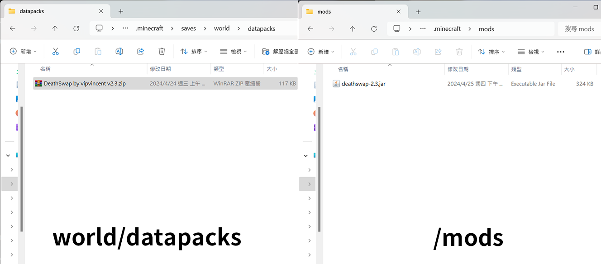
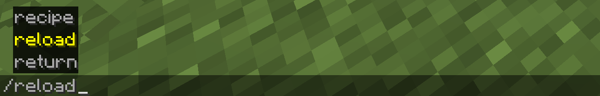
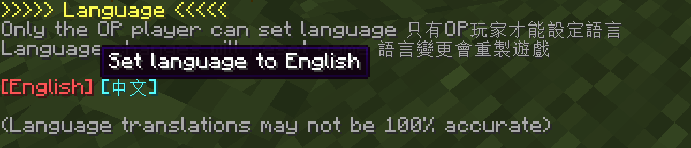
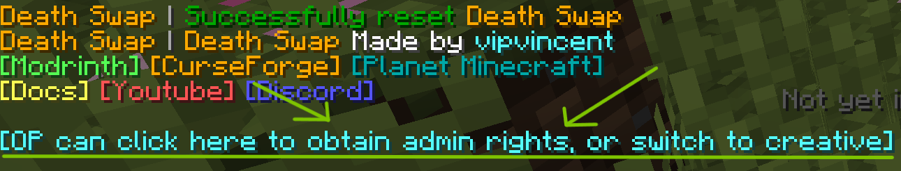
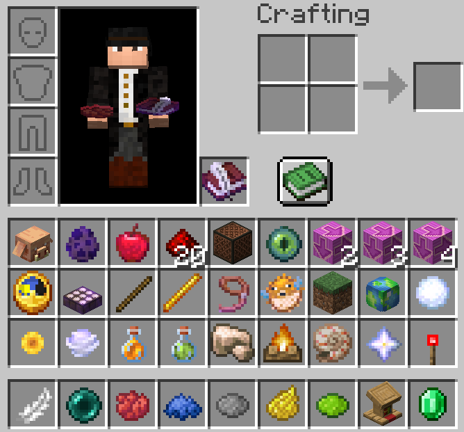

# How to Install

:::warning
Death Swap is recommended for installation in newly created worlds.  
If installed in an existing world, it will cause your equipment, items, or blocks to disappear, and more likely cause world damage.    
So if you still want to install in an existing world, make sure your world is backed up.  
I am not responsible for any damage to the world, software conflicts, or other problems that may result. The user is solely responsible.   
:::

Data packs are placed in the `datapacks` folder under the world folder; mod are placed in the `mods` folder.

:::tip
Mod versions is the same as datapack, but it will automatically apply to all worlds, usually on servers.  
If you don't want to apply to all worlds, please use datapack.  
:::
:::info
Mod loader support for **Fabric**, **Forge**, **Neoforge** and **Quilt**  
Fabric requires [**Fabric API**](https://modrinth.com/mod/fabric-api)，Quilt requires [**Quilted Fabric API**](https://modrinth.com/mod/qsl)
:::

Then you can enter the game, and then the OP player enters /reload to install it.

After typing /reload, a language setting interface will pop up. Please select your language. This interface can only be operated by OP players.

Then the game will be remade. If you are an OP player, please click on the prompt in the chat room, or switch to creative mode to obtain administrator rights.

Manually grant administrator permissions to view the [**Command list**](./command#tag-add-admin)

After obtaining administrator rights, you can open the backpack and set up the game.

