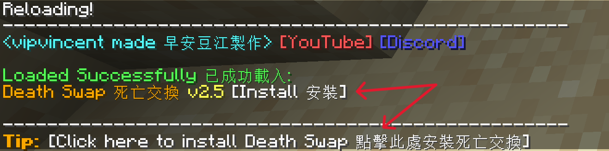

# Installation Guide

Data packs are placed in the `datapacks` folder under the world folder; mod are placed in the `mods` folder.

:::tip

The features of the mod and the data pack are identical.   
Data pack will only apply to a single world, mod will apply to all worlds.   
Fabric requires [**Fabric API**](https://modrinth.com/mod/fabric-api)，Quilt requires [**Quilted Fabric API**](https://modrinth.com/mod/qsl)   

:::

Then you can enter the game, and then the OP player enters `/reload`.

After entering `/reload`, click Install Deathswap, or enter `/function deathswap:install`.

After the installation is complete, a language setting interface will pop up. Please select your language.

Then the game will be remade. If you are an OP player, please click on the prompt in the chat room, or switch to creative mode to obtain administrator rights.   
Manually grant administrator permissions to view the [**Command list**](./command#tag-add-admin)

After obtaining administrator rights, you can open the backpack and set up the game.

