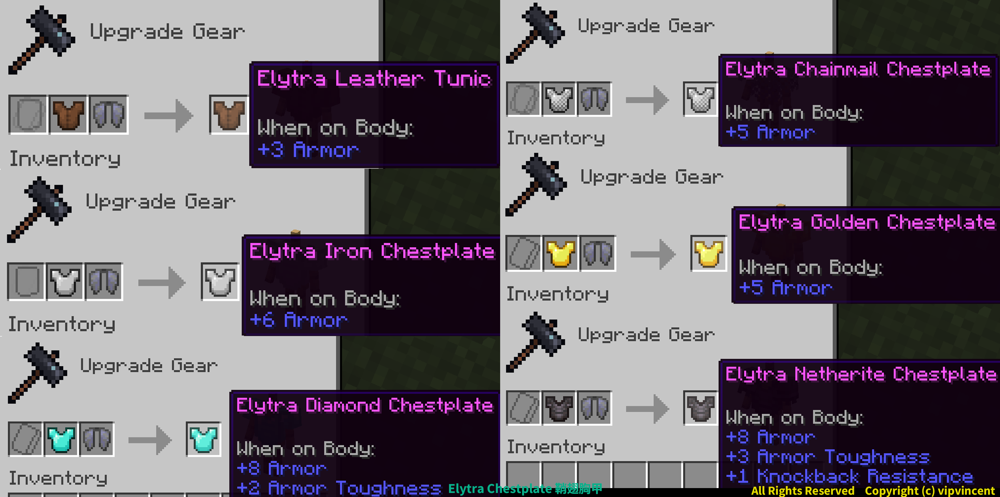

# Elytra Chestplate

Chestplate and Elytra can be crafting by the Smithing Table, and used on the player at the same time, and both functions can be used.

- Chestplate and elytra can be used and displayed at the same time
- Support armor trim
- Supports all Minecraft languages

---
## Craft

:::info

The existing enchantments, durability, and naming of the breastplate will be retained when crafted, but those on the elytra will not be retained.

:::

---
## Download

<a className="button button--success button--lg" target="_blank" href="https://modrinth.com/datapack/elytra_chestplate">Modrinth</a>
