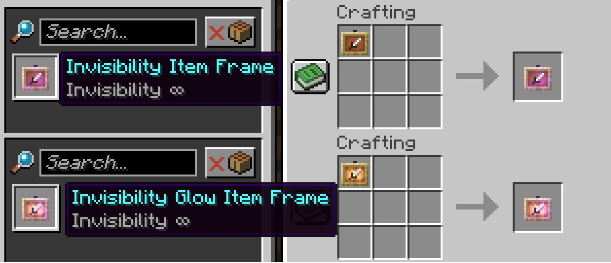

import Link from '@docusaurus/Link';

# Craftable Invisible Item Frame

Allows invisibility Item Frame that originally need to be obtained through commands,now can be craft.

---
## Craft

---
## Download

<Link className="button button--success button--lg" href="https://modrinth.com/datapack/invisibility-itemframe">Modrinth</Link>

##
:::note

The mod version is only now available on the Modrinth website

:::
:::info

Mod loader only support **Fabric**, **Forge** and **Quilt**, not support **Neoforge**  
Fabric requires [**Fabric API**](https://modrinth.com/mod/fabric-api)，Quilt requires [**Quilted Fabric API**](https://modrinth.com/mod/qsl)

:::

